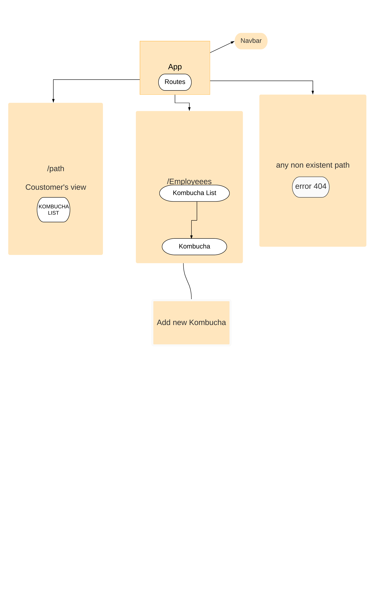

# _TapRoom_

#### _Kombucha Inventory Management, 2019_

#### By _**Neha Malhotra**_

## Description

_In this application Employees can keep track of inventory of kombucha and Coustomers can view the options of kombucha avaialble in different brands._

## Setup/Installation Requirements

* _Clone this repository https://github.com/nehamalhotra23/TapRoom_
* _Run "npm intall" in the root directory_
* _Run "npm run start" and navigate to  http://localhost:8080/#/_

## Specs
| Behavior | Input | Output |
| ------------- |:-------------:| -----:|
| Allow user to view list of kombucha in different brands  |  click on "GT's" in navigation bar |  GT's all flavours of kombucha will be displayed |
| Employeess can add new kombucha in the list |  click on "Add new kombucha" in navigation bar |A form will be displayed to add new kombucha.|
| Employess can login and can Create new account | click on "Sign In" in navigation bar  | Sign In Form will be displayed |

## Known Bugs

_There are no known bugs._

## Support and contact details

_Contact Neha at nehamalhotra8999@gmail.com_

## Technologies Used

_HTML, CSS , React and Npm Packages_

### License

Copyright (c) 2019 **{Neha Malhotra}**
